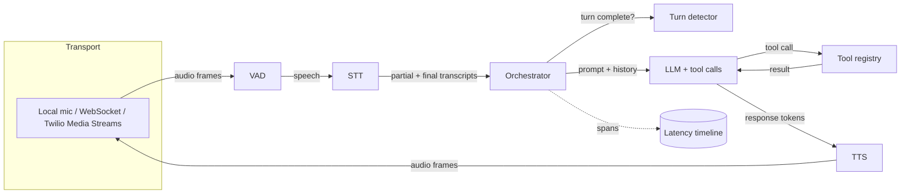

# voceval

A provider-agnostic real-time voice-agent runtime, plus a simulation-based
evaluation framework that catches regressions in CI.

The first voice-agent demo is easy. Keeping it good is not: a prompt change that
helps one caller breaks barge-in for another, p95 latency drifts past a second,
the model starts confirming reservations it never actually made. voceval is two
parts that deal with that:

1. **A runtime** — a streaming `VAD → STT → LLM(+tools) → TTS` pipeline with
   interruption handling, turn detection, and per-turn latency tracing. Every
   provider is an interface with a mock implementation, so the whole thing runs
   with zero API keys.
2. **An eval harness** — an LLM-driven *simulated caller* runs scripted scenarios
   (interruptions, accents, ambiguity, out-of-scope asks) against the agent,
   scores each run on both **transcript correctness** and **voice-specific
   metrics**, and fails a GitHub Actions job when a run regresses against a saved
   baseline.

Status: alpha. Built in the open, see the commit history.

## Why voice-specific metrics

Transcript-only evals miss the failures that define a voice product: the agent
that takes 1,400 ms to start talking, the one that keeps speaking over the caller
for two full seconds after they interrupt, the one whose first audio frame lands
late even though the transcript is perfect. `voceval` scores:

| Dimension | Examples |
|---|---|
| Task success | Did the reservation get booked with the right party size and time? |
| Policy adherence | No confirming actions that weren't actually taken; correct hours quoted |
| Turn latency | p50 / p95 of *user-stopped-speaking → agent-first-audio* |
| Interruption response | Time from caller barge-in to agent going quiet |
| Talk-over ratio | Fraction of agent speech that overlapped the caller |

## Architecture



The eval harness swaps `Transport` for a `SimulatedCaller` (another LLM with a
persona and a goal) and records the full timeline for scoring.

## Quickstart

```bash
python -m venv .venv
.venv\Scripts\activate        # Windows; use source .venv/bin/activate elsewhere
pip install -e ".[dev]"
```

```bash
# talk to the restaurant agent from the terminal (mock providers, no keys)
voceval chat --agent examples/restaurant_agent.py
```

```bash
# run one scenario and print the transcript, checks and metrics
voceval simulate --scenario scenarios/restaurant/happy_path_booking.yaml
```

```bash
# run the whole suite and compare against the baseline, same as CI
voceval eval --suite scenarios/restaurant --baseline .voceval/baseline.json
```

Set `VOCEVAL_TIME_SCALE=0.1` to run the suite in a few seconds instead of real
time while iterating.

### Talk to it in the browser

```bash
voceval serve --agent examples/restaurant_agent.py
```

Then open `examples/browser_client/index.html`. Recognition and playback run in
the browser; the agent runs on the server over a WebSocket. No keys needed.

To use real providers, copy `.env.example` to `.env`, fill in the keys you have,
and set `VOCEVAL_PROVIDER_PROFILE=live`.

## Repo layout

```
src/voceval/
  pipeline/      VAD, STT, LLM, TTS interfaces + mock and live implementations
  tools/         tool registry + the restaurant agent's tools
  tracing/       per-turn latency timeline and metric aggregation
  eval/          simulated caller, scenarios, scorers, runner, regression gate
  transport/     local audio, WebSocket server, Twilio Media Streams
scenarios/       YAML scenario definitions
examples/        runnable agents and a browser client
```

## License

MIT
